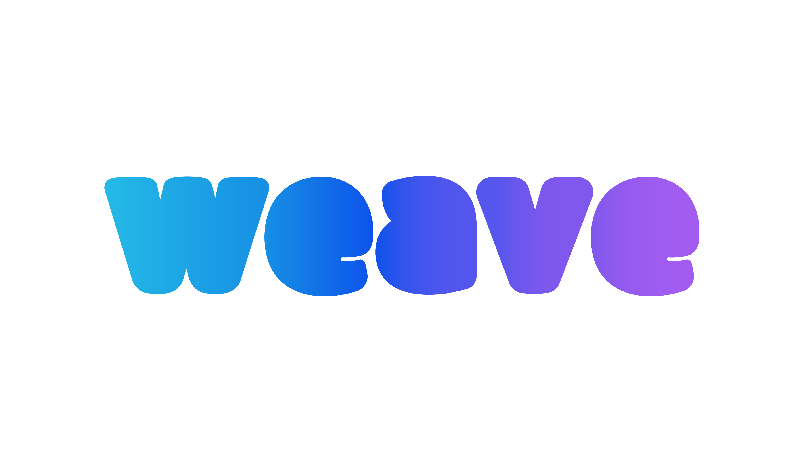

# 

#### Weave - Ironhack Project 3 (Week 8-9)

[](https://www.npmjs.com/)
[](https://github.com/CGuillotG/IH-Project2)
[](https://github.com/CGuillotG/IH-Project2)
[](https://community-ihproject2.herokuapp.com/)
[](https://projects.ironhack.com.mx/projects/5c4b87d818a0f50017f374a5/2)


### Sobre Community

Community es una plataforma digital que reúne a la gente para llegar a un beneficio en común.

La plataforma integra a individuos o empresas pequeñas para que en conjunto puedan hacer compras al mayoreo.

Esto se puede aplicar en diversas formas:

```
Medicina - Acercar a los pacientes al acceso a medicinas a un menor costo.

Seguros (Auto, Vida, Escolar, Retiro) - Acercar a los usuarios el acceso a seguros a un menor costo

Entretenimiento - Reducir costos.

Ironhack - ....
```

### Como Acceder

Para acceder a community solo se requiere accesar al sitio web:

```
https://community-ihproject2.herokuapp.com/
```

Una vez ahí se debe crear un usuario que por default es comprador.

Con usuario de comprador se puede acceder al catálogo de productos.

```
Para realizar compras se utiliza PayPal, sin embargo como el sitio aun

está en construcción se esta utilizando en modo testing.

```


```
Esto significa que PayPal les pedirá que creen una "cuenta nueva" en la cual

todos los datos pueden ser falsos excepto el numero de tarjeta (ya que Paypal

valida si es Mastercard o Visa).

```


## Autores

* **Carlos Ortíz** - *Ironhacker* - [CarlosOrtizPacheco](https://github.com/carlosortizpacheco)
* **Carlos Guillot** - *Ironhacker* - [CGuillotG](https://github.com/CGuillotG)

## Reconocimientos

* IronHack
* BlisS y TAs
* café, mucho café

<!-- Markdown link & img dfn's -->
[npm-image]: https://img.shields.io/npm/v/datadog-metrics.svg?style=flat-square
[npm-url]: https://npmjs.org/package/datadog-metrics
[npm-downloads]: https://img.shields.io/npm/dm/datadog-metrics.svg?style=flat-square
[travis-image]: https://img.shields.io/travis/dbader/node-datadog-metrics/master.svg?style=flat-square
[travis-url]: https://travis-ci.org/dbader/node-datadog-metrics
[wiki]: https://github.com/yourname/yourproject/wiki
